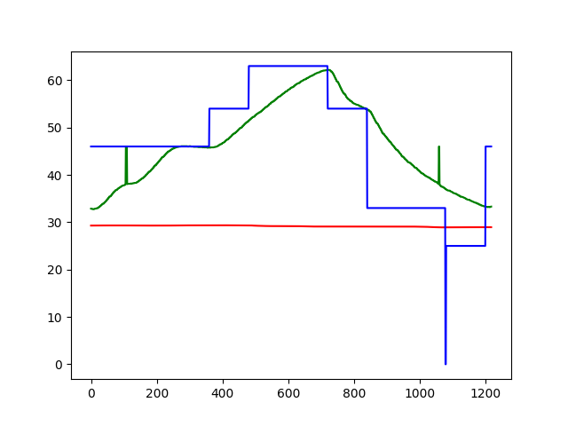

# Fundamentos de sistemas embarcados - Projeto 1

Renato Britto Araujo - 180027239

# Como usar

Basta compilar e rodar com o commando `make`. Haverá uma opção de escolher entre uma curva reflow, potenciometro e input diretamente do terminal.

# Experimentos

O experimento envolvendo a curva de reflow pode ser visto abaixo, foi utilizado um KP = 50, KI = 0.2 e KD = 400 para se conseguir os valores.

